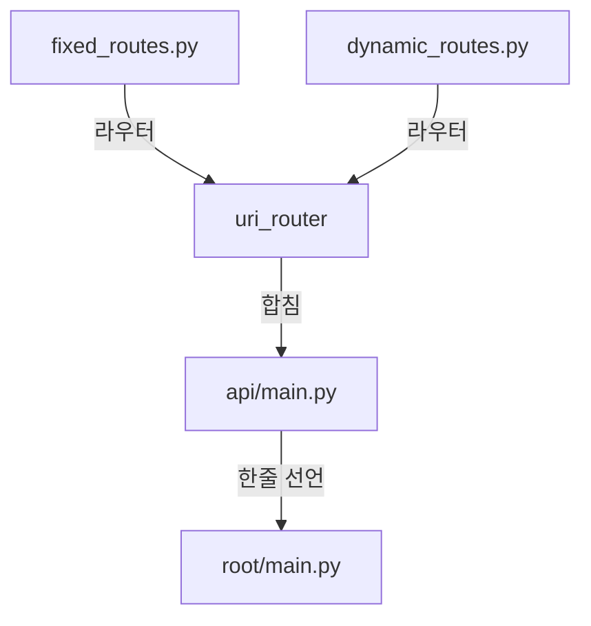
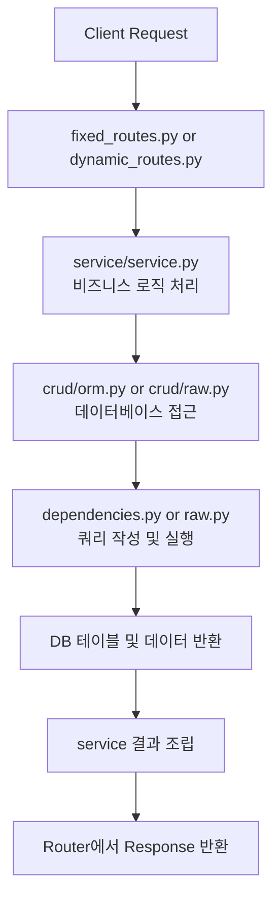

# 개발 가이드 라인
## db 연결 방법 및 다중연결

- [DB접속 파일](../app/api/dependencies/db.py)


```py
from collections.abc import Generator
from typing import Annotated
from sqlmodel import Session
from fastapi import Depends

from app.core.db import engine, outlier_engine


def get_db() -> Generator[Session, None, None]:
    """기본 엔진 연결 세션 생성"""
    with Session(engine) as session:
        yield session

SessionDep = Annotated[Session, Depends(get_db)]  # 메인 DB 세션 의존성
```


## DB 연결 추가

- [DB접속 파일](../app/core/configs/db/outlier_db.py)
- 해당 코드에서 아래와 같이 DB 접속 정보를 입력합니다.
- self.OUTLIER_USER 같은경우 .env에서 선언한 뒤 가져오세요
- 새로운 db를 연결할때
    * [x]새로운 파일을 만들어서 1파일 1연결정보로 한다
    * [ ]db파일 하나에 모든 db 연결정보를 넣는다.

```py

class Settings(BaseSettings):
    model_config = SettingsConfigDict(
        env_file=str(Path().resolve() / ".env"),
        extra="ignore",
    )
    OUTLIER_SERVER: str = "localhost"
    OUTLIER_PORT: int = 5432
    OUTLIER_USER: str = "user"
    OUTLIER_PASSWORD: str = ""
    OUTLIER_DB: str = ""

    @property
    def SQLALCHEMY_DATABASE_URI(self) -> MultiHostUrl:
        return MultiHostUrl.build(
            scheme="postgresql+psycopg",
            username=self.OUTLIER_USER,
            password=self.OUTLIER_PASSWORD,
            host=self.OUTLIER_SERVER,
            port=self.OUTLIER_PORT,
            path=self.OUTLIER_DB,
        )
# outlier_db_setting가 output으로 사용될 수 있도록 설정합니다.
outlier_db_setting: Settings = Settings()

```

## DB 접속
- [config.py](../app/core/config.py)

```py
    # OUTLIER_DB_Settings 인스턴스 필드 추가
    # outlier_db_setting을 호출해서 db 환경정보를 가져오고 Settings에 set한다.
    @property
    def OUTLIER_SQLALCHEMY_DATABASE_URI(self) -> MultiHostUrl:
        # 분리된 OUTLIER DB URI 반환
        return outlier_db.outlier_db_setting.SQLALCHEMY_DATABASE_URI
```

### engin 생성
- [db.py](../app/core/db.py)

```py
# 아래와 같이 OUTLIER_SQLALCHEMY_DATABASE_URI를 가져와 create_engine를 생성합니다.
# 앞으로 쿼리 호출할때 outlier_engine을 사용하면 됩니다.
outlier_engine = create_engine(str(settings.OUTLIER_SQLALCHEMY_DATABASE_URI))
```

### ORM, Raw Query 작성
- 참고문헌: [ORM과 Raw SQL: 장단점 비교 및 활용 사례](https://f-lab.kr/insight/orm-vs-raw-sql-20240804)


#### ORM 방식
- [orm.py](../app/api/outlier_detection/cruds/orm.py)
    - [models.py](../app/api/dependencies/models.py)

모델 영역에서 아래와 같이 테이블 구조 형태를 정의해놔야 합니다.
```py
class MyNosqlTableCode(SQLModel, table=True):
    # Pylance 호환을 위해 ClassVar로 타입 명시
    __tablename__: ClassVar[str] = "my_nosql_table_code"
    __table_args__: ClassVar[Dict[str, str]] = {"schema": "MEASURE"}
    id: Optional[int] = Field(
        default=None,
        primary_key=True,
        sa_column_kwargs={
            "server_default": text(
                "nextval('\"MEASURE\".my_nosql_table_id_seq'::regclass)"
            )
        },
    )
    tag_id: Optional[str] = Field(default=None, max_length=100, description="db tag id")
    tag_desc: Optional[str] = Field(
        default=None, max_length=100, description="db tag 설명"
    )
    missing_value_fill: Optional[float] = Field(
        default=None, description="결측치 보완 임시 데이터"
    )
    plc_id: Optional[str] = Field(default=None, max_length=100, description="plc id")
    plc_desc: Optional[str] = Field(
        default=None, max_length=100, description="plc 설명"
    )
    plc_addr: Optional[str] = Field(
        default=None, max_length=100, description="plc 주소"
    )
    plc_panel: Optional[str] = Field(
        default=None, max_length=100, description="plc 판넬"
    )
    group_id: Optional[int] = Field(
        default=None, description="그룹 id (유입펌프장, 생물반응조 등등)"
    )
    need_filter: Optional[int] = Field(
        default=None, description="이상치 제거 대상 여부"
    )
```
JPA와 비슷한 테이블 구조 형태로 데이터를 가져옵니다.
```py
from app.api.dependencies.models import MyNosqlTableCode
from sqlmodel import Session, select
from sqlmodel import Session
from typing import Optional, List

from app.core.db import outlier_engine  # 실제 엔진 import


def get_meas_data(*, session: Session) -> Optional[List[MyNosqlTableCode]]:
    print("crud get_meas_data(*, session: Session) ")
    statement = select(MyNosqlTableCode)
    results = session.exec(statement).all()
    return None if not results else list(results)

```

정의된 테이블끼리 조인연산이 가능합니다.

```py
from sqlmodel import select, Session
from models import TableA, TableB  # 모델 정의 필요

def get_joined_data(session: Session):
    stmt = (
        select(TableA, TableB)
        .join(TableB, TableA.id == TableB.a_id)
        .where(TableA.is_active == True)
    )
    results = session.exec(stmt).all()
    return results  # (TableA, TableB) 튜플 리스트 반환

```
`.join(TableB, TableA.id == TableB.a_id)` 형태로 조인합니다.


#### raw query(기존 sql 작성법)
- [raw.py](../app/api/outlier_detection/cruds/raw.py)

```py
from typing import Dict, List
from sqlalchemy import text
from sqlmodel import Session


# 반환값을 dict 형태로 변경함
def run_raw_query(session: Session, query: str) -> List[Dict]:
    statement = text(query)
    result = session.execute(statement)
    return [dict(row) for row in result.fetchall()]


# 이 형태로 여러 쿼리를 작성
def get_active_users_raw(session: Session) -> List[Dict]:
    query = """
    SELECT id, data, meas_dtm, group_id FROM "MEASURE".my_nosql_table_data_filter ORDER BY id LIMIT 100
    """
    return run_raw_query(session, query)

```
## routes 작업
라우터 엔드포인트에는 고정 라우터와 동적 라우터가 있다.
차이점은 아래와 같다.
```py
# 고정 라우터
@router.get("/test01")
# 동적 라우터
@router.get("/test01/{id}")
```

파이썬은 기본적으로 인터프리터 형태의 언어이기 때문에 먼저 선언된 코드의 분기를 타면 그 이후에는 작동하지 않는다. 만약 동적 라우터가 고정 라우터보다 상단에 존재하면 /test01로 호출시 fastAPI는 즉시 동적 라우터인 /test01/을 태우고 뒤에 동적으로 오는 id값에 아무데이터가 오지 않았다며 오류를 발생시킨다.
그래서 고정과 동적라우터를 사용시 둘의 작성 위치를 분명히 해야 한다.

위와같은 이유로 현재 routes는 fixed_routes.py와 dynamic_routes.py로 나누고 그걸 URI 라우터로(가명)합친 뒤 api/main.py로 모든 URI 라우터를 합치고 마지막으로 root/main.py에 한줄로 선언하는 형태이다.

- [\_\_init\_\_](../app/api/outlier_detection/routes/__init__.py)
엔드포인트의 prefix와 tags는 __init__에 정의한다.

`router = APIRouter(prefix=API_PREFIX, tags=API_TAGS)` 


#### fixed_routes
- [fixed_routes.py](../app/api/outlier_detection/routes/fixed_routes.py)

기본적으로 session은 내가 사용할 db연결의 session을 의미한다.

`SessionOutlierDep`는 `app.api.dependencies.db`에서 가져온다.
즉 라우터 호출단계에서부터 어떤 db에 접속할건지 선택하는걸 fastAPI에서는 권장한다.
> ! 기존 full-stack 템플릿에서도 router에서 db session 연결을 시도하고있으나 공식문서에는 이를 권장한다는 내용을 찾기 어렵다. db연결이 복수로 늘어날 경우 service단에서 하는게 맞지 않을까 라는 생각을 하는데 자세한 내용을 파악후 업데이트하겠다.

```py
from typing import Any

from app.api.dependencies.db import SessionOutlierDep as Session
from app.api.dependencies.auth import CurrentUser
from app.models import Message
from fastapi import APIRouter, Query
from app.api.outlier_detection.serivce import service

from . import API_PREFIX, API_TAGS

router = APIRouter(prefix=API_PREFIX, tags=API_TAGS)

@router.get("/test01")
def get_test(
    session: Session,
    current_user: CurrentUser,
    skip: int = 0,
    limit: int = 100,
) -> Message:
    """
    nivskorea 테스트 전용 API입니다. 이건 라우터 분리한 곳에서 밖에 없지요
    """
    result = "nivskorea 테스트 전용 API입니다. 이건 라우터 분리한 곳에서 밖에 없지요"
    return Message(message=result)
```

#### dynamic_routes
- [dynamic_routes.py](../app/api/outlier_detection/routes/dynamic_routes.py)

```py
import uuid
from typing import Any

from fastapi import APIRouter, HTTPException

from app.api.dependencies.db import SessionOutlierDep as SessionCors
from app.api.dependencies.auth import CurrentUser
from app.models import Item, ItemPublic, ItemUpdate, Message
from . import API_PREFIX, API_TAGS

router = APIRouter(prefix=API_PREFIX, tags=API_TAGS)


@router.get("/{id}", response_model=ItemPublic)
def read_item(session: SessionCors, current_user: CurrentUser, id: uuid.UUID) -> Any:
    """
    Get item by ID.
    """
    item = session.get(Item, id)
    if not item:
        raise HTTPException(status_code=404, detail="Item not found")
    if not current_user.is_superuser and (item.owner_id != current_user.id):
        raise HTTPException(status_code=400, detail="Not enough permissions")
    return item
```

#### routes.py

> !!!!!!! 너무 무조건 fixed_routes를 dynamic_routes보다 상단에 둬야합니다.!!!!!!!!!

```py
from . import dynamic_routes, fixed_routes
from fastapi import APIRouter

router = APIRouter()
router.include_router(fixed_routes.router) # 이게 무조건 아래의 dynamic보다 위에 와야 합니다!!!
router.include_router(dynamic_routes.router)

```

## Request-Response Lifecycle

1. fixed_routes.py or dynamic_routes.py에서 엔드포인트 선언

2. serivce\serivce.py에서 비즈니스 로직(logic폴더 안의 소스 활용 가능)

3. crud\orm.py or crud\raw.py로 데이터 베이스에서 데이터 접근

4. dependencies or raw.py의 쿼리 작성으로 테이블 및 데이터 반환

5. return


